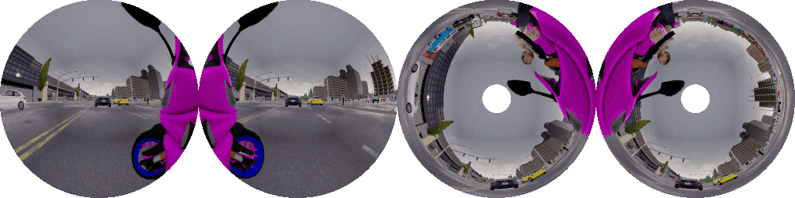

## Paper

### __The OmniScape Dataset__

Ahmed Rida Sekkat¹, Yohan Dupuis², Pascal Vasseur¹ and Paul Honeine¹.  
¹Normandie Univ, UNIROUEN, LITIS, Rouen, France  
²Normandie Univ, UNIROUEN, ESIGELEC, IRSEEM, Rouen, France  
ahmed-rida.sekkat@univ-rouen.fr

IEEE International Conference on Robotics and Automation (ICRA), 2020.

### Abstract
Despite the utility and benefits of omnidirectional images in robotics and automotive applications, there are no datasets of omnidirectional images available with semantic segmentation, depth map, and dynamic properties. This is due to the time cost and human effort required to annotate ground truth images. This paper presents a framework for generating omnidirectional images using images that are acquired from a virtual environment. For this purpose, we demonstrate the relevance of the proposed framework on two well-known simulators: CARLA simulator, which is an open-source simulator for autonomous driving research, and Grand Theft Auto V (GTA V), which is a very high quality video game. We explain in details the generated OmniScape dataset, which includes stereo fisheye and catadioptric images acquired from the two front sides of a motorcycle, including semantic segmentation, depth map, intrinsic parameters of the cameras and the dynamic parameters of the motorcycle. It is worth noting that the case of two-wheeled vehicles is more challenging than cars due to the specific dynamic of these vehicles.

## Dataset Release
The dataset and tools will be provided in stages as soon as the article is published.  
  
If you are interested in The OmniScape Dataset, please fulfill [This Form](https://forms.gle/XSrUSsnwGPcyhv2B9) to receive the first release.

## Teasers

### CARLA simulator: 

*The images are provided in different weather conditions:*

### GTA V:

**This work was supported by a RIN grant, Région Normandie, France*
