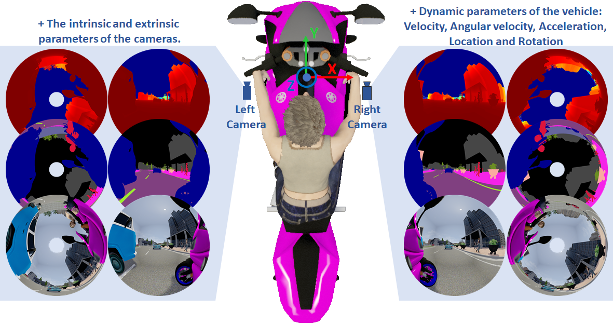

# __The OmniScape Dataset__

## News
...

## Paper (Submitted to RA-L and ICRA)

### __The OmniScape Dataset__

__Ahmed Rida Sekkat__, Normandie Univ, UNIROUEN, LITIS, Rouen, France, ahmed-rida.sekkat@univ-rouen.fr  
Yohan Dupuis, Normandie Univ, UNIROUEN, ESIGELEC, IRSEEM, Rouen, France  
Pascal Vasseur, Normandie Univ, UNIROUEN, LITIS, Rouen, France  
Paul Honeine, Normandie Univ, UNIROUEN, LITIS, Rouen, France

### Abstract
Despite the utility and benefits of omnidirectional images in robotics and automotive applications, there are no dataset of omnidirectional images available with semantic segmentation, depth map, and dynamic properties. This is due to the time cost and human effort required to annotate ground truth images. This paper presents a framework for generating omnidirectional images using images that are acquired from a virtual environment. For this purpose, we demonstrate the relevance of the proposed framework on two well-known simulators: CARLA simulator, which is an open-source simulator for autonomous driving research, and Grand Theft Auto V (GTA V), which is a very high quality video game. We explain in details the generated OmniScape dataset, which includes stereo fisheye and catadioptric images acquired from the two front sides of a motorcycle, including semantic segmentation, depth map, intrinsic parameters of the cameras and the dynamic parameters of the motorcycle. It is worth noting that the case of two-wheeled vehicles is more challenging than cars due to the specific dynamic of these vehicles.

## Teasers 

### CARLA simulator 

### GTA V
1. A sequence of fisheye stereo images, divided on subsequences where is shown the depth map then the semantic segmentation. The cameras are placed on the chassis of a motorcycle, one is positioned on the right side of the  motorcycle and the other one on the left side.  

2. A sequence of catadioptric stereo images, divided on subsequences where is shown the depth map then the semantic segmentation. The cameras are placed on the roof of a car, positioned one above the other.  

## Dataset Release
The dataset and tools will be provided in stages as soon as the article is published.  
  
Please fulfill [This Form](https://forms.gle/XSrUSsnwGPcyhv2B9 ) if you are interested in the Dataset.   

**This work was supported by a RIN grant, Région Normandie, France*
