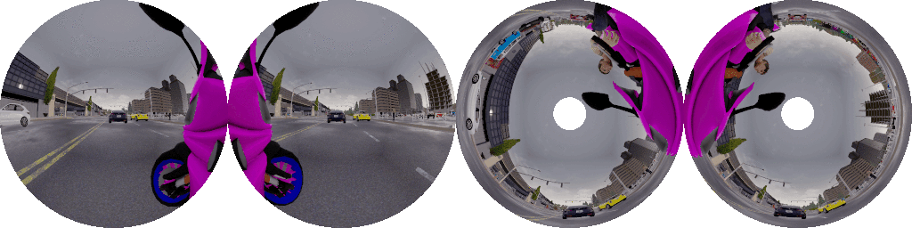

[](https://www.youtube.com/watch?v=MdJanz2z7b0&list=PL4jFAx3iziLO9If7esOYJse2A86L68UBi)

## Paper:

### [__The OmniScape Dataset__](https://drive.google.com/file/d/1fb7tvN-5vI1LlBswMyEKA8ckaKcDHrIF/preview)

Ahmed Rida Sekkat¹, Yohan Dupuis², Pascal Vasseur¹ and Paul Honeine¹.  
¹Normandie Univ, UNIROUEN, LITIS, Rouen, France  
²Normandie Univ, UNIROUEN, ESIGELEC, IRSEEM, Rouen, France  
ahmed-rida.sekkat@univ-rouen.fr

IEEE International Conference on Robotics and Automation (ICRA), 2020.

If you find our dataset useful for your research, please cite our [paper](https://drive.google.com/file/d/1fb7tvN-5vI1LlBswMyEKA8ckaKcDHrIF/preview):

```
@INPROCEEDINGS{9197144,  
author={A. R. {Sekkat} and Y. {Dupuis} and P. {Vasseur} and P. {Honeine}},  
booktitle={2020 IEEE International Conference on Robotics and Automation (ICRA)},   
title={The OmniScape Dataset},   
year={2020},
pages={1603-1608},
doi={10.1109/ICRA40945.2020.9197144}}
```

### Abstract
Despite the utility and benefits of omnidirectional images in robotics and automotive applications, there are no datasets of omnidirectional images available with semantic segmentation, depth map, and dynamic properties. This is due to the time cost and human effort required to annotate ground truth images. This paper presents a framework for generating omnidirectional images using images that are acquired from a virtual environment. For this purpose, we demonstrate the relevance of the proposed framework on two well-known simulators: CARLA simulator, which is an open-source simulator for autonomous driving research, and Grand Theft Auto V (GTA V), which is a very high quality video game. We explain in details the generated OmniScape dataset, which includes stereo fisheye and catadioptric images acquired from the two front sides of a motorcycle, including semantic segmentation, depth map, intrinsic parameters of the cameras and the dynamic parameters of the motorcycle. It is worth noting that the case of two-wheeled vehicles is more challenging than cars due to the specific dynamic of these vehicles.

### Video Presentation
[](https://www.youtube.com/watch?v=k5LdjaF5cvg)

## Additional modalities:
- The class Vehicle is divided into two classes, four-wheeled and two-wheeled.
- Optical Flow.
- Instance semantic segmentation.
- 3D bounding boxes.

## Dataset Release:
The dataset and tools will be provided in stages as soon as the article is published.  
  
If you are interested in our dataset, fulfill [This Form](https://forms.gle/XSrUSsnwGPcyhv2B9) to receive the first release.

## Demos:

### CARLA simulator: 
<a href="https://www.youtube.com/watch?v=mPKxEr0iAtg&list=PL4jFAx3iziLO9If7esOYJse2A86L68UBi"></a>
<a href="https://www.youtube.com/watch?v=p0djiVtWdYA&list=PL4jFAx3iziLO9If7esOYJse2A86L68UBi"></a>
<a href="https://www.youtube.com/watch?v=Ob8ktcU_MWM&list=PL4jFAx3iziLO9If7esOYJse2A86L68UBi"></a>
<a href="https://www.youtube.com/watch?v=JY4yysszPI4&list=PL4jFAx3iziLO9If7esOYJse2A86L68UBi"></a>

Instance segmentation:

<a href="https://www.youtube.com/watch?v=VwSSHnwQ5xc&list=PL4jFAx3iziLO9If7esOYJse2A86L68UBi"></a>
<a href="https://www.youtube.com/watch?v=xdb5uV5Rjq0&list=PL4jFAx3iziLO9If7esOYJse2A86L68UBi"></a>

For each capture stereo 360° cubemap and equirectangular images are also provided:

<a href="https://www.youtube.com/watch?v=9iQcYbET320&list=PL4jFAx3iziLO9If7esOYJse2A86L68UBi"></a>
<a href="https://www.youtube.com/watch?v=9iQcYbET320&list=PL4jFAx3iziLO9If7esOYJse2A86L68UBi"></a>
<a href="https://www.youtube.com/watch?v=fEjJFAKrXm0&list=PL4jFAx3iziLO9If7esOYJse2A86L68UBi"></a>
<a href="https://www.youtube.com/watch?v=fEjJFAKrXm0&list=PL4jFAx3iziLO9If7esOYJse2A86L68UBi"></a>

The images are provided in different weather and lighting conditions:


### GTA V:
<a href="https://www.youtube.com/watch?v=TndNQuGZv4A&list=PL4jFAx3iziLO9If7esOYJse2A86L68UBi"></a>
<a href="https://www.youtube.com/watch?v=L2JfevOPlTg&list=PL4jFAx3iziLO9If7esOYJse2A86L68UBi"></a>

**This work was supported by a RIN grant, Région Normandie, France*
